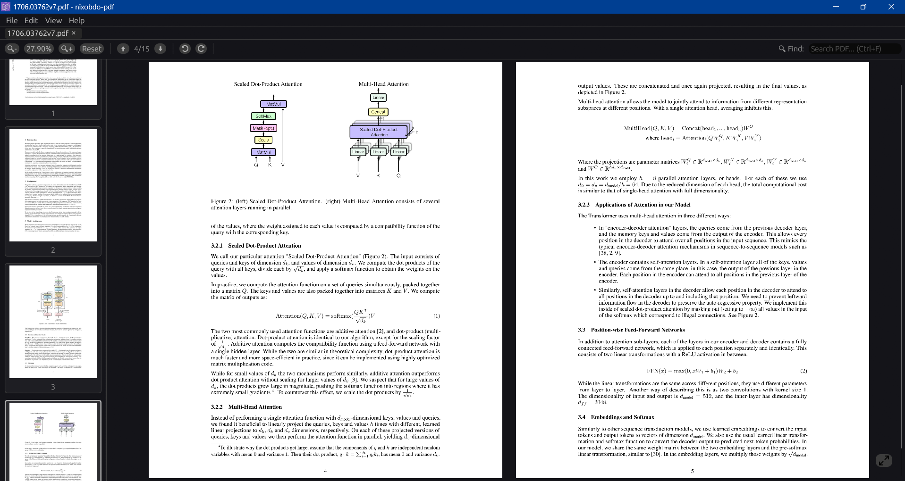
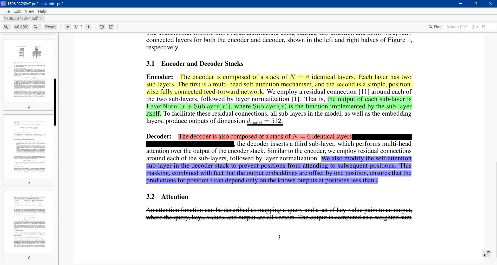

<div align="center">


# nixobdo-pdf

**An open-source PDF viewer with the sole intention to provide distraction-free PDF experience that we enjoyed in the old Adobe PDF reader, before they added multiple entities and made it too distracting. Its free and will always remain free.**

[](https://github.com/borneelphukan/nixobdo-pdf/releases/latest)
[](https://github.com/borneelphukan/nixobdo-pdf/releases)

</div>

---

## Quick Start

1. Download the latest version from **[GitHub Releases](https://github.com/borneelphukan/nixobdo-pdf/releases/latest)**.
2. Run the application directly.

> [!NOTE]
> The project requires the PDFium library to be present alongside the executable or in the `lib/` directory.

---

## Features

- **Distraction-Free Viewing**: Open and view any standard PDF document in a clean, minimalistic interface.
- **Smooth Navigation**: Scroll up and down pages smoothly using the mouse wheel.
- **Dynamic Zoom**: Zoom in and out effortlessly with `Ctrl + Mouse Wheel` or by using the built-in Zoom slider.
- **Secure Signatures**: Add your digital signatures to documents securely.

---

## Snapshots

<div align="center">


<br />
<br />


</div>

---

## Setup & Build

To build for Windows, you will need the Windows version of `pdfium.dll`.

1. Ensure Rust is installed on your system.
2. Download `pdfium-win-x64.tgz` (or x86) from [bblanchon/pdfium-binaries](https://github.com/bblanchon/pdfium-binaries/releases).
3. Extract `pdfium.dll` and place it in the `lib/` directory or next to the executable.
4. Run the application:
   ```bash
   cargo run
   ```

---

## Technical Details

This project leverages the following technologies:

- **`eframe`/`egui`**: For a fast, immediate-mode GUI.
- **`pdfium-render`**: For robust PDF processing and rendering.
- **`rfd`**: For native file dialogs.

