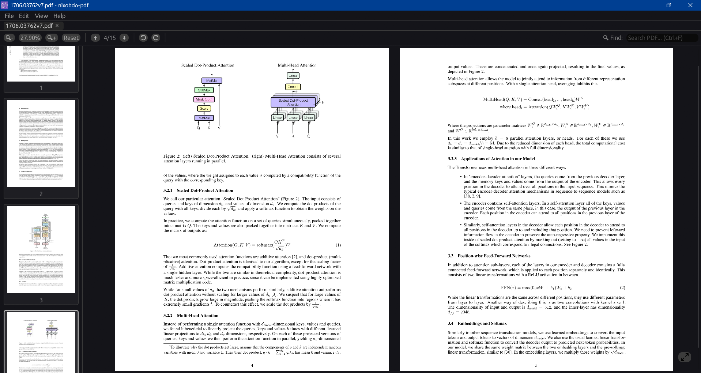
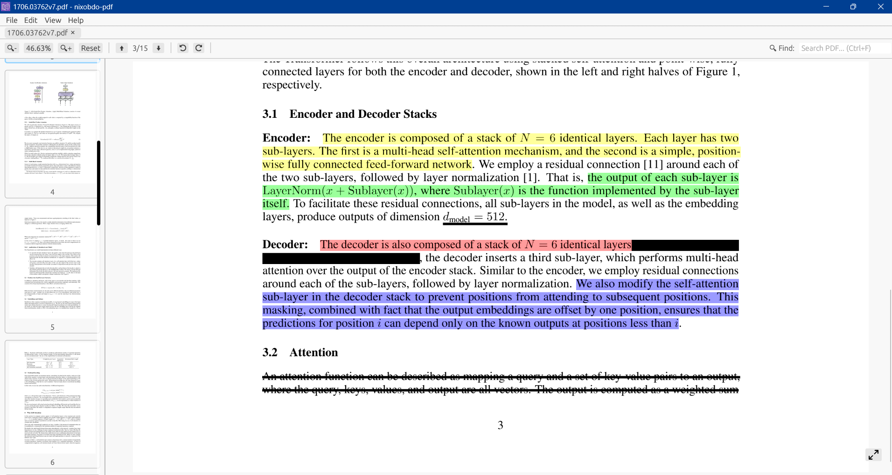

<div align="center">


# nixobdo-pdf

**An open-source PDF viewer with the sole intention to provide distraction-free PDF experience that we enjoyed in the old Adobe PDF reader, before they added multiple entities and made it too distracting. Its free and will always remain free.**

[](https://github.com/borneelphukan/nixobdo-pdf/releases/latest)
[](https://github.com/borneelphukan/nixobdo-pdf/releases)

</div>

---

## Quick Start

### Windows
1. Download `nixobdo-pdfSetup.exe` from **[GitHub Releases](https://github.com/borneelphukan/nixobdo-pdf/releases/latest)**.
2. Run the installer and launch the app.

### Ubuntu / Debian
Download the `.deb` package from **[GitHub Releases](https://github.com/borneelphukan/nixobdo-pdf/releases/latest)** and install:
```bash
sudo apt install ./nixobdo-pdf_*_amd64.deb
```
*Alternatively, download the portable tarball (`nixobdo-pdf-*-linux-x64.tar.gz`), extract it, and run `./install.sh`.*

> [!NOTE]
> The application bundles the PDFium library in installer packages. For manual builds, PDFium must be placed alongside the executable or in the `lib/` directory.

---

## Features

- **Distraction-Free Viewing**: Open and view any standard PDF document in a clean, minimalistic interface.
- **Secure Signatures**: Add your digital signatures to documents securely.
- **Annotation Tools**: Easily highlight, redact, underline content within your documents, including fill forms with the `Add Text` feature.
- **File Conversion**: Convert your PDF to .doc, .docx, .png or .jpg

---

## Snapshots

<div align="center">


<br />
<br />


</div>

---

## Setup & Build

### Windows
1. Ensure Rust is installed on your system.
2. Download `pdfium-win-x64.tgz` from [bblanchon/pdfium-binaries](https://github.com/bblanchon/pdfium-binaries/releases).
3. Extract `pdfium.dll` and place it in the `lib/` directory or next to the executable.
4. Run:
   ```bash
   cargo run
   ```

### Linux (Ubuntu / Debian)
1. Install system prerequisites:
   ```bash
   sudo apt update
   sudo apt install -y libgtk-3-dev libxcb-render0-dev libxcb-shape0-dev libxcb-xfixes0-dev libxkbcommon-dev libssl-dev pkg-config
   ```
2. Download `pdfium-linux-x64.tgz` from [bblanchon/pdfium-binaries](https://github.com/bblanchon/pdfium-binaries/releases) and extract `libpdfium.so` into the project directory (or `lib/`).
3. Run:
   ```bash
   cargo run
   ```

---

## Technical Details

This project leverages the following technologies:

- **`eframe`/`egui`**: For a fast, immediate-mode GUI.
- **`pdfium-render`**: For robust PDF processing and rendering.
- **`rfd`**: For native file dialogs.

